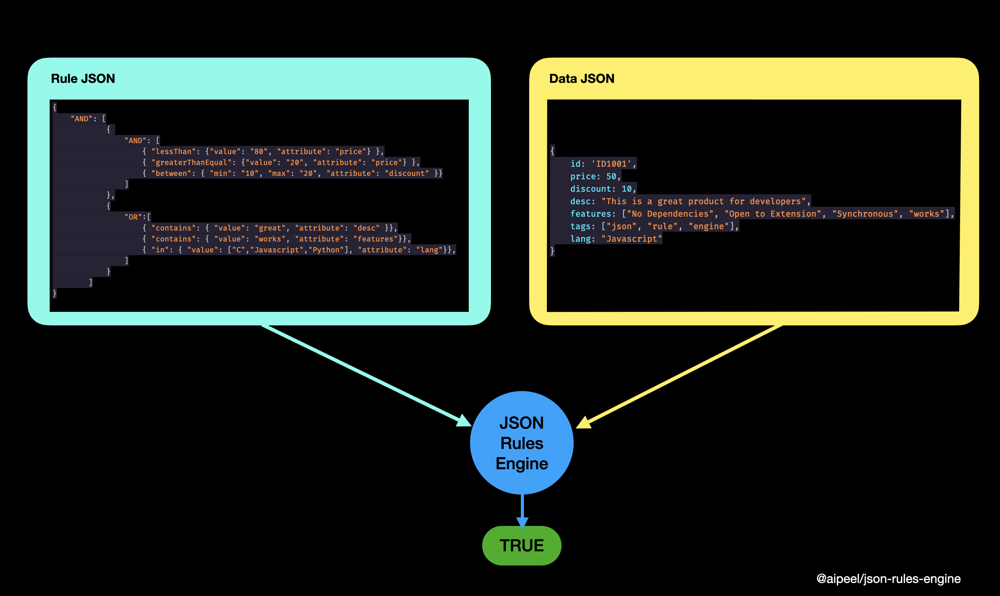

# JSON Rule Engine

## What does it do?
Pass a Rule and Data to engine and provide synchronous response on whether the Data satisfies the Rules.



## Installation

```
    npm install @aipeel/json-rules-engine
```

## Usage
### Step 1: Define Rules JSON
1. Rules JSON must be an object
1. Must start with AND or OR which takes array of rule
    1.  Single Rule Criteria
    ```
    {
        AND: [ Criteria1 ]
    }
    ```
    2. Multiple Rule Criteria --> Criteria 1 and 2 must be satisfied
    ```
    {
        AND: [ Criteria1, Criteria2 .. ]
    }
    ```
    3. Multiple Levels of Rules --> Criteria 1 & 2 must be satisfied and either Criteria3 or Criteria4 must be satisfied
    ```
    {
        AND: [
                {
                    AND: [ Criteria1, Criteria2 ...]
                },
                {
                    OR: [Criteria3, Criteria4 ..]
                }
            ]
    }
    ```
1. Each Criteria must be an object 
    1. The key in criteria is an operator and value defines the metadata required for the operator to work<br><br>Examples of Criteria
        ```json
        { 
            "between": { 
                            "min": "10", 
                            "max": "20", 
                            "attribute": "discount" 
                        }
        }
        ```
        ```json
        { 
            "in": { 
                    "value": ["C","Javascript","Python"], 
                    "attribute": "lang"
                }
        }
        ```
    1. List of all criteria given below

        | Operator         | Operator Property   | Description                                                                          | Example                                                                                         |   |
        |------------------|---------------------|--------------------------------------------------------------------------------------|-------------------------------------------------------------------------------------------------|---|
        | between          | min, max, attribute | Check if the property mentioned in  attribute has value between min and max          | ``` {  "between" :  {  "min" :   "10" ,  "max" :   "20" ,  "attribute" :   "discount"  }} ```   |   |
        | lessThan         | value, attribute    | Check if the property mentioned in  attribute has number less than value             | ``` {  "lessThan" :  { "value" :   "80" ,  "attribute" :   "price" } } ```                      |   |
        | lessThanEqual    | value, attribute    | Check if the property mentioned in  attribute has number less than or equal value    | ``` {  "lessThanEqual" :  { "value" :   "80" ,  "attribute" :   "price" } } ```                 |   |
        | greaterThan      | value, attribute    | Check if the property mentioned in  attribute has number greater than value          | ``` {  "greaterThan" :  { "value" :   "80" ,  "attribute" :   "price" } } ```                   |   |
        | greaterThanEqual | value, attribute    | Check if the property mentioned in  attribute has number greater than or equal value | ``` {  "greaterThanEqual" :  { "value" :   "80" ,  "attribute" :   "price" } } ```              |   |
        | equal            | value, attribute    | Check if the property mentioned in  attribute has value equal to value provided      | ``` {  "equal" :  { "value" :   "80" ,  "attribute" :   "price" } } ```                         |   |
        | contains         | value, attribute    | Check if the property mentioned in  attribute contains the value given.              | ``` {  "contains" :  {  "value" :   "great" ,  "attribute" :   "desc"  }} ```                   |   |
        | in               | value, attribute    | Check if the property mentioned in  attribute is available in value array provided.  | ``` {  "in" :  {  "value" :  [ "C" , "Javascript" , "Python" ],  "attribute" :   "lang" }}  ``` |   |

    1. A Rules JSON could be defined as
    ```json
    { 
        "AND": [
            { "lessThan": {"value": "80", "attribute": "price"} },
            { "greaterThanEqual": {"value": "20", "attribute": "price"} },
            { "between": { "min": "10", "max": "20", "attribute": "discount" }}
        ]
    }
    ```
    ```json
    {
        "OR":[
            { "contains": { "value": "great", "attribute": "desc" }},
            { "contains": { "value": "works", "attribute": "features"}},
            { "in": { "value": ["C","Javascript","Python"], "attribute": "lang"}},
        ]
    }
    ```

1. Rules can be recursively nested as shown below
    ```json
    {
        "AND": [
                { 
                    "AND": [
                        { "lessThan": {"value": "80", "attribute": "price"} },
                        { "greaterThanEqual": {"value": "20", "attribute": "price"} },
                        { "between": { "min": "10", "max": "20", "attribute": "discount" }}
                    ]
                },
                {
                    "OR":[
                        { "contains": { "value": "great", "attribute": "desc" }},
                        { "contains": { "value": "works", "attribute": "features"}},
                        { "in": { "value": ["C","Javascript","Python"], "attribute": "lang"}},
                    ]
                }
            ]
    }
    ```

### Step2: Pass Data JSON and Rule JSON to Engine
```js
    const Engine = require("@aipeel/json-rules-engine")

    Engine.apply(data,rule) // returns boolean - true or false
```

## Complete end-to-end example below for reference

```js
const Engine = require("@aipeel/json-rules-engine")

const rule = {
                    "AND": [
                            { 
                                "AND": [
                                    { "lessThan": {"value": "80", "attribute": "price"} },
                                    { "greaterThanEqual": {"value": "20", "attribute": "price"} },
                                    { "between": { "min": "10", "max": "20", "attribute": "discount" }}
                                ]
                            },
                            {
                                "OR":[
                                    { "contains": { "value": "great", "attribute": "desc" }},
                                    { "contains": { "value": "works", "attribute": "features"}},
                                    { "in": { "value": ["C","Javascript","Python"], "attribute": "lang"}},
                                ]
                            }
                        ]
                    }

let data = {
    id: 'ID1001',
    price: 50,
    discount: 10,
    desc: "This is a great product for developers",
    features: ["No Dependencies", "Open to Extension", "Synchronous", "works"],
    tags: ["json", "rule", "engine"],
    lang: "Javascript"
}

// example 1
console.log(`Does the data conform to rule? --> ${Engine.apply(data,rule)?"Yes":"No"}`);

//example 2
data.price = 100;
console.log(`Does the data conform to rule? --> ${Engine.apply(data,rule)?"Yes":"No"}`);

//example 3
data.price = 50;
data.discount = 21;
console.log(`Does the data conform to rule? --> ${Engine.apply(data,rule)?"Yes":"No"}`);
```

Output
```yml
Does the data conform to rule? --> Yes
Does the data conform to rule? --> No
Does the data conform to rule? --> No
```